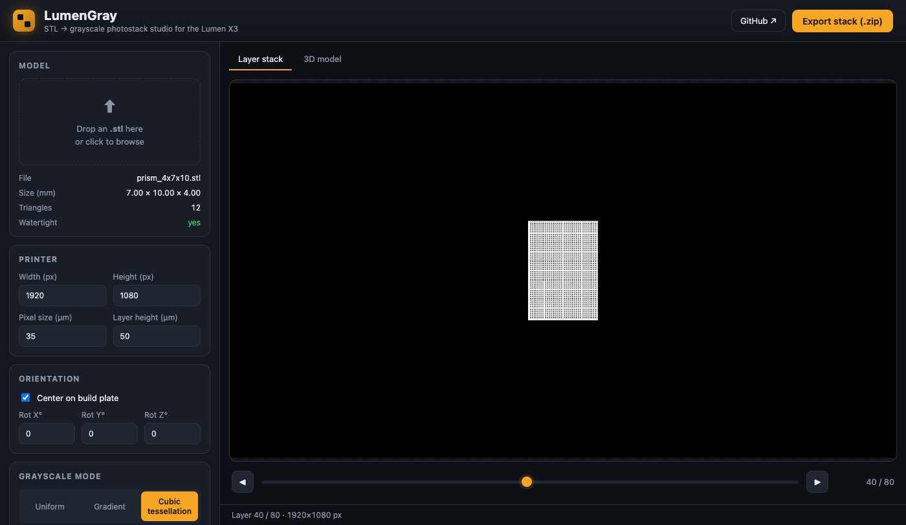
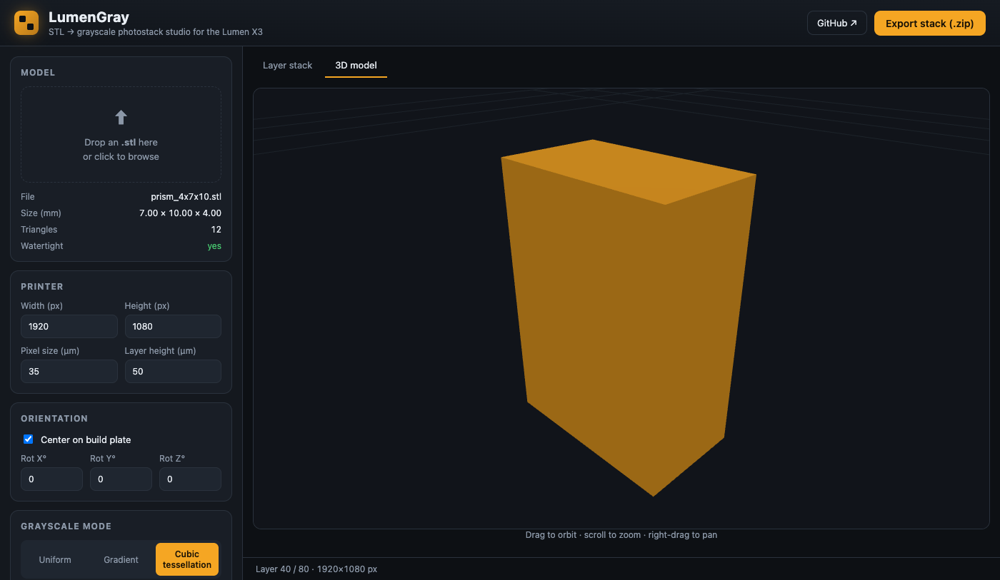
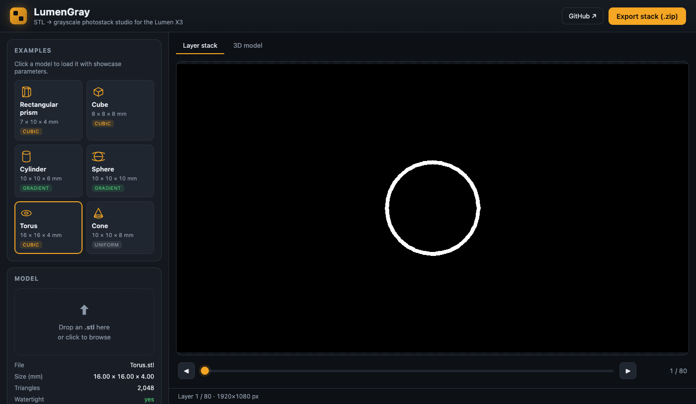
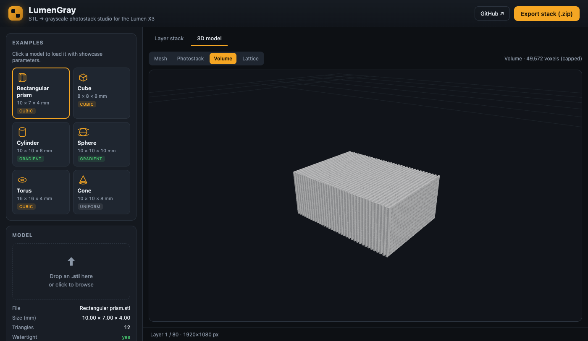
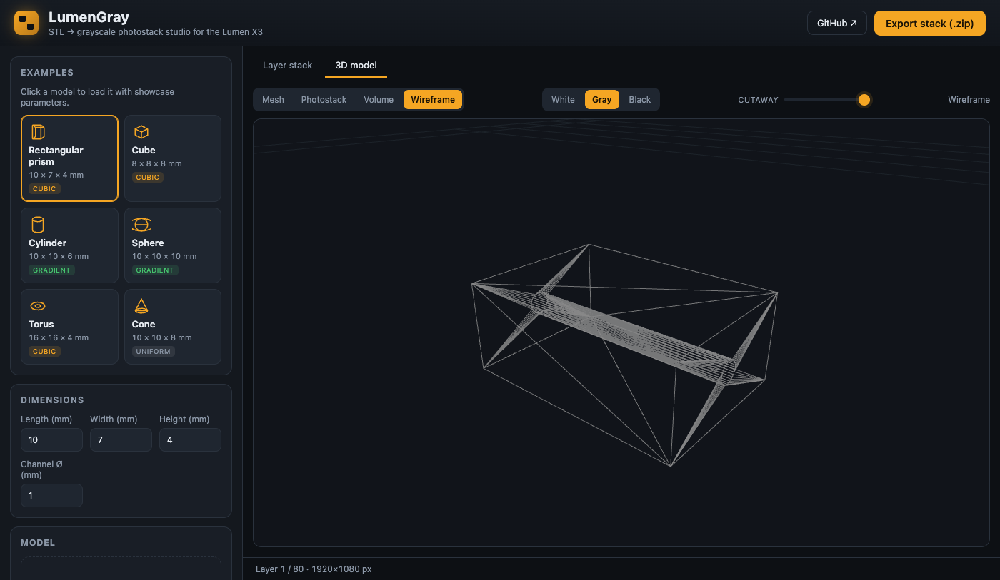

# LumenGray

**STL → grayscale photostack studio for the [Lumen X3](https://en.wikipedia.org/wiki/Volumetric_display).**

LumenGray turns a 3D model into an ordered stack of 8-bit grayscale PNG masks — one per
print layer — where the gray value of every pixel sets the *local exposure*. It replaces
the manual "Chitubox config → slice/export → ImageJ paint" workflow with a scriptable
library, a CLI, and a browser studio where you can tweak parameters and watch the layer
stack update live.



---

## Highlights

- **One-click examples** — six built-in models (prism, cube, cylinder, sphere, torus, cone)
  with **editable dimensions** (the prism can drill an optional length-wise channel),
  each pre-loaded with showcase parameters.
- **Drag-and-drop any STL** — slices to a registered, fixed-canvas photostack.
- **Five grayscale modes**
  - **Uniform** — flat exposure for every cured pixel.
  - **Edge-feather gradient** — gray ramps from walls/holes into the core by distance.
  - **Cubic tessellation** — white cube-edge support columns (grey faces/core), solid-white
    caps, a per-layer white outer-wall rim, and an optional black-void core per cell.
  - **Triangular prisms** — vertical strut columns + flat triangular frames (a triangular
    grid extruded in Z; no sloped struts).
  - **Octet truss** — Buckminster-Fuller's space-filling **tetrahedra + octahedra** (the FCC
    strut lattice): sloped struts run diagonally between layers, so the cells are true 3D
    pyramids. Defined by its strut segments — a voxel is white when within the strut radius
    of one — so the printed photostack and the 3D cage are one geometry.
- **Structure→core gradient** — grade any tessellation cell from white struts inward
  to a black core with a designable exposure ramp (adjustable **speed** and
  **continuous vs piecewise** stepped levels) — a functionally-graded material. Design
  it live on the 3D **Element** view (a single unit cell).
- **Connect voids (gyroid overlay)** — a toggle that carves a continuous gyroid
  (triply-periodic minimal surface) void through *any* mode's output, threading the
  isolated black/lumen pockets into one interconnected, drainable perfusion network
  (a tissue-scaffold vasculature analogue).
- **Live web studio** — upload, scrub the layer stack (with zoom), orbit the model in 3D
  (Mesh / Photostack / Wireframe / 1:1 Voxels / Element), hover-tooltips on every parameter, export.
- **Reproducible** — every photostack ships a `manifest.json` (source + all parameters) and a
  parameter-encoded zip name; every run is fully described by one JSON config.



---

## Install

```bash
python -m venv .venv && source .venv/bin/activate
pip install -e ".[web]"     # core + web UI; drop [web] for just the CLI/library
```

## Run it in the cloud (share with anyone — no install)

Host LumenGray once and everyone just opens a **URL** — any OS, no Python, no
download. Every push to GitHub auto-redeploys the latest code.

[](https://render.com/deploy?repo=https://github.com/rsiegemit/LumenGray)

Click the button → sign in to Render → **Apply**. In ~2 minutes you get a public
URL (e.g. `https://lumengray.onrender.com`) running this repo, redeploying on
every push (`render.yaml`). The blueprint builds from the repo **`Dockerfile`**
(Docker runtime) for a deterministic build, so the same image also runs on
Fly.io / Hugging Face Spaces / Railway / Cloud Run. (Render's free tier sleeps
when idle and wakes on the next visit; the first hit after a nap takes a few
seconds, and it fits the 512 MB free tier.)

## The web studio (run locally)

```bash
lumengray-web               # opens http://127.0.0.1:8000 in your browser
# or: python -m lumengray.web
```

Upload an STL — or click an **Example** to load a built-in model with showcase parameters —
pick a grayscale mode, drag the sliders, and the **Layer stack** preview re-slices live
(scroll-zoom + drag-pan). Hit **Export stack (.zip)** for the full set of PNG masks plus a
`manifest.json`.

The **3D model** tab has three orbitable views:

- **Mesh** — the input STL.
- **Photostack** — the literal rendered layers stacked as thin slices.
- **Wireframe** —
  - For **tessellation** modes (cubic / triangular prisms / octet): a **Cage** draws the
    actual strut lattice — columns + square/triangular frame edges, or the octet's
    sloped tetrahedra struts — as crisp 3D lines computed from the parameters and
    clipped per layer (each frame to its own slice silhouette, struts only where the
    part is) so it follows curved shapes — letting you see the real structure the voxel
    grid is too coarse to resolve. **Solid** fills it as a voxel body instead.
  - Isolate the photostack's exposure **bands** — toggle any combination of
    **white** (structure), **gray** (diffusion/adhesion), and **black** (lumen /
    interior voids), with two editable thresholds. **Solid** is a fast downsampled
    voxel preview; **1:1** renders *true machine voxels* — one point per print
    pixel (35×35×50 µm) at its real exposure, so it's a literal preview of what the
    printer lays down. A layer-range slab + the Cutaway keep the millions of
    voxels interactive; pick a single band to inspect just the structure or the
    lumen network before printing.

A **Cutaway** slider clips any view to see inside.





## The CLI

```bash
# Uniform white masks (defaults: 1920×1080 @ 35µm XY, 50µm Z)
lumengray model.stl -o ./out --preview

# Hollow-cube infill (drag-and-drop on any STL)
lumengray model.stl --cubic-tessellation -o ./out --grey-value 128

# Everything driven by a JSON config
lumengray model.stl -c config.tessellation.json -o ./out
```

Useful flags: `--layer-height-um`, `--falloff-mm`, `--rotate-x/y/z`, `--prefix`,
`--preview` (writes a contact-sheet thumbnail grid).

## As a library

```python
from lumengray import load_config, run
summary = run("model.stl", "./out", load_config("config.tessellation.json"))
print(summary["layers"], "masks written")
```

---

## Config schema

```jsonc
{
  "printer": { "resolution": [1920, 1080], "pixel_size_um": 35, "layer_height_um": 50 },
  "model":   { "center_xy": true, "rotation_deg": [0, 0, 0] },
  "grayscale": {
    "default_solid_value": 255,                 // uniform fill for cured pixels

    "gradient": {                               // OR an edge-feather gradient
      "type": "edge_feather", "min": 40, "max": 255, "falloff_mm": 0.35
    },

    "regions": [                                // OR painted shapes (rect/circle/polygon)
      { "name": "dot", "value": 128, "units": "mm",
        "shape": { "type": "circle", "cx": -12, "cy": 6, "r": 2 },
        "layers": [1, 20], "clip_to_solid": true }
    ],

    "cubic_tessellation": {                      // OR the hollow-cube strut infill
      "cap_bottom_layers": 2, "cap_top_layers": 2,
      "cube_xy_px": 6, "cube_z_layers": 6, "shell_px": 1,
      "core_px": 0,                              // optional black-void cube per cell (0 = none)
      "boundary_px": 3, "grey_value": 128, "white_value": 255
    },

    "triangular_tessellation": {                 // OR triangular prisms (columns + flat frames)
      "cap_bottom_layers": 2, "cap_top_layers": 2,
      "tri_px": 10, "z_layers": 6, "shell_px": 1,
      "core_px": 0, "boundary_px": 3, "grey_value": 128, "white_value": 255
    },

    "octet_tessellation": {                      // OR the octet truss (Fuller tetrahedra+octahedra)
      "cap_bottom_layers": 2, "cap_top_layers": 2,
      "cell_xy_px": 14, "cell_z_layers": 10,     // FCC cube-cell edge (node spacing = half)
      "strut_px": 1,
      "core_px": 0,                              // octahedral black-void core per cell (0 = none)
      "boundary_px": 3, "grey_value": 128, "white_value": 255
    },

    "connect_voids": {                           // overlay on ANY mode: gyroid lumen-connector
      "cell_mm": 0.8,                            // gyroid unit-cell period (channel spacing)
      "channel_px": 4,                           // carved void channel width (voxels)
      "skin_px": 3                               // solid wall kept at the boundary
    },

    "grade": {                                   // structure->core exposure ramp (tessellation cells)
      "speed": 1.0,                              // ramp curve/steepness
      "steps": 0                                 // 0 = continuous; N>=2 = piecewise levels
    }
  }
}
```

(Wireframe is a 3D *visualization*, not a grayscale mode, so it has no config block.)

### Tessellation, in detail

A tessellation tiles the model interior with a strut lattice: white **support struts**
(columns at the grid nodes, braced by horizontal frames every `z`/`cube_z_layers` layers),
grey faces/core, solid-white caps top and bottom, and a white rim on the part's **outer
wall** (solid pixels within `boundary_px` of an edge, L∞ / chessboard — internal channels are
excluded). An optional **`core_px`** carves a black void in each cell's centre.

Both kinds share one base (`tessellation._assemble`); a *kind* only supplies its XY grid —
**cubic** uses a square grid (columns + rows), **triangular** uses three line families at
60° (equilateral triangles). Everything is reasoned about in **voxels** — one voxel is an
output pixel in XY and one photostack layer in Z — so at the Lumen X3's 35 µm XY / 50 µm Z
the cells are deliberately *approximate*. Struts live on a single shared grid, so neighbours
share edges/nodes instead of doubling them.

---

## How it works

```
STL ─► orient ─► slice (trimesh) ─► per-layer binary mask
                                       │
              grayscale mode ──────────┤
                                       ▼
                         8-bit PNG photostack  +  manifest.json
```

| Module | Role |
|--------|------|
| `slicer.py` | STL → registered binary layer masks (fixed world-space canvas) |
| `grayscale.py` | uniform / gradient base fill + region overlay |
| `tessellation.py` | shared tessellation base + the cubic kind |
| `triangulation.py` | triangular-prism kind, reusing the shared base |
| `octet.py` | octet truss (Fuller tetrahedra+octahedra): strut generator + per-layer voxelizer |
| `gyroid.py` | gyroid void-connector overlay (carves a TPMS lumen network into any layer) |
| `grade.py` | structure→core exposure gradient (distance-from-struts ramp for tessellation cells) |
| `geometry.py` | mm ↔ output-pixel coordinate mapping |
| `config.py` | immutable, validated config + `config_to_dict` serializer |
| `pipeline.py` | end-to-end run, shared single-layer renderer, manifest + naming |
| `web/` | FastAPI backend + zero-build ES-module SPA (core/api/config/viewer3d/app) |

### Metadata & naming

Every photostack includes a **`manifest.json`** recording what made it: the **source**
(uploaded STL filename, or preset name + the dimensions used) and the **full grayscale mode +
parameters**, plus printer/model settings, layer count, and a timestamp. The exported zip is
named from those parameters, e.g. `Rectangular-prism_50um_cubic-xy6-z6-s1-b3_core2.zip`.

## Development

```bash
pip install -e ".[web]"
python smoke_test.py    # end-to-end: regions, gradient, rotation, cubic + triangular tessellation, manifest
```

## License

MIT
